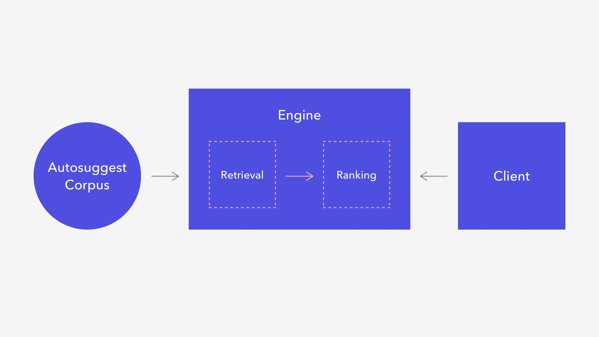

# Auto-Suggest-System

Building an Autosuggest System

the components of our auto suggest system:

1.Autosuggest Corpus — A static dataset of suggestions that we can offer users. This is computed offline at a scheduled interval and loaded into the engine.

2.Engine — A REST API responsible for Retrieval (getting the list of candidate suggestions for a given user input) and Ranking (ordering the retrieved suggestions).

3.Client — The client application that runs in your browser, asks the engine for results, and displays them to the user.
